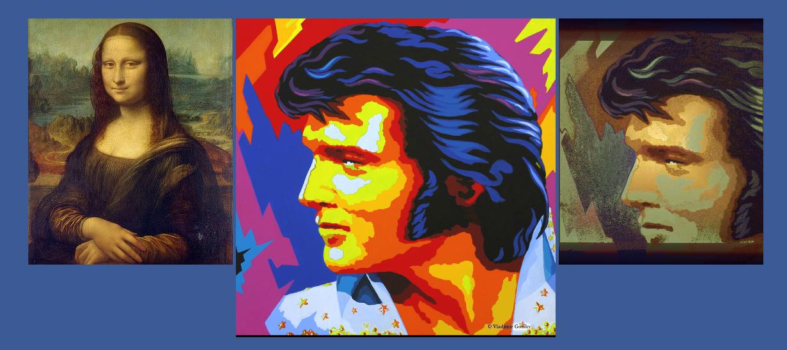

# American-Gothic-in-the-Palette-of-Mona-Lisa
This is old at this point, but I've decided to throw the code out there.  

I saw [this post](http://codegolf.stackexchange.com/questions/33172/american-gothic-in-the-palette-of-mona-lisa-rearrange-the-pixels) and decided that it would be a fun challenge.  The task is to create a program which takes two images and attempts to recreate the second image by rearranging the pixels of the first image. 

I created this in about 4 hours, so you know, there's a lot of low hanging fruit for improved results. 

